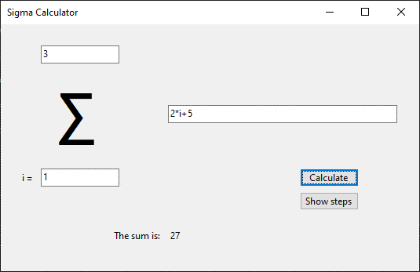
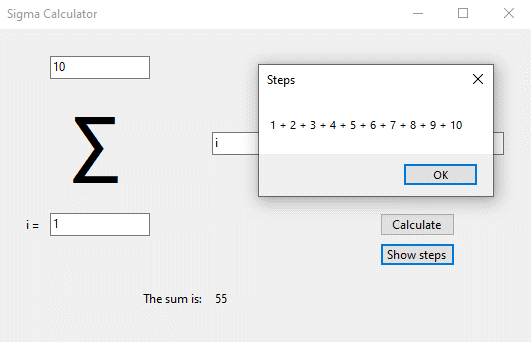
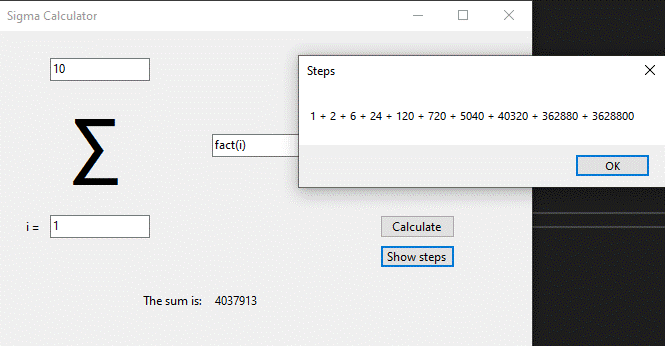

# Sigma Calculator
This is a simple app to calculate the sum of sigma notation.

### Current features
- Can show you the individual terms before they are summed up
- Support for normal arithmetic operations (+, -, *, /)
- Supports factorial by typing fact(x), where x is the number for which you want to calculate
- Should support all functions from C# [System.Math](https://docs.microsoft.com/en-us/dotnet/api/system.math?view=net-5.0)
- Should also support for all functionality from the [NCalc library](https://github.com/ncalc/ncalc)

Shows a simple example of use: 

Shows the steps: 

Example of factorial: 

